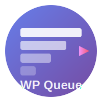

<p align="center">
  
</p>

<h1 align="center">WP Queue</h1>

<p align="center">
  <strong>Laravel Horizon-like queue manager for WordPress</strong><br>
  Simple, powerful, and modern background job processing.
</p>

<p align="center">
  <a href="https://packagist.org/packages/rwsite/wp-queue"></a>
  <a href="https://packagist.org/packages/rwsite/wp-queue"></a>
  <a href="https://github.com/rwsite/wp-queue/actions"></a>
  <a href="https://codecov.io/gh/rwsite/wp-queue"></a>
  <a href="LICENSE"></a>
</p>

<p align="center">
  <a href="#features">Features</a> •
  <a href="#installation">Installation</a> •
  <a href="#quick-start">Quick Start</a> •
  <a href="#admin-ui">Admin UI</a> •
  <a href="#wp-cli">WP-CLI</a> •
  <a href="#rest-api">REST API</a>
</p>

---

## Features

- 🚀 **Laravel-style API** — Clean, fluent job dispatching with PHP 8 attributes
- 📦 **Multiple Drivers** — Database, Redis, Memcached, Sync (auto-detection)
- 🔄 **Auto Retries** — Exponential backoff for failed jobs
- ⏰ **Scheduling** — Cron-like job scheduling
- 👁️ **WP-Cron Monitor** — View, run, pause, resume, edit cron events
- 📊 **Dashboard** — Beautiful admin UI with statistics
- 🔌 **REST API** — Full API for integrations
- 💻 **WP-CLI** — Complete command-line interface
- 🌍 **i18n Ready** — Translations included (Russian)

## Requirements

- PHP 8.3+
- WordPress 6.0+

## Installation

1. Clone or download to `wp-content/plugins/wp-queue`
2. Run `composer install`
3. Activate the plugin

## Quick Start

### Create a Job

```php
use WPQueue\Jobs\Job;
use WPQueue\Attributes\{Schedule, Queue, Timeout, Retries};

#[Schedule('hourly')]
#[Queue('imports')]
#[Timeout(120)]
#[Retries(5)]
class ImportProductsJob extends Job
{
    public function __construct(
        private array $productIds
    ) {
        parent::__construct();
    }

    public function handle(): void
    {
        foreach ($this->productIds as $id) {
            // Import logic here
        }
    }
    
    public function failed(\Throwable $e): void
    {
        // Handle failure
        error_log('Import failed: ' . $e->getMessage());
    }
}
```

### Dispatch Jobs

```php
use WPQueue\WPQueue;

// Dispatch to queue
WPQueue::dispatch(new ImportProductsJob([1, 2, 3]));

// With delay (seconds)
WPQueue::dispatch(new ImportProductsJob($ids))->delay(60);

// To specific queue
WPQueue::dispatch(new ImportProductsJob($ids))->onQueue('high-priority');

// Synchronous (bypass queue)
WPQueue::dispatchSync(new ImportProductsJob($ids));

// Chain jobs
WPQueue::chain([
    new FetchProductsJob(),
    new ImportProductsJob($ids),
    new NotifyAdminJob(),
])->dispatch();

// Batch jobs
WPQueue::batch([
    new ImportProductJob($id1),
    new ImportProductJob($id2),
    new ImportProductJob($id3),
])->dispatch();
```

### Schedule Jobs

```php
// In your plugin
add_action('wp_queue_schedule', function ($scheduler) {
    // Using attributes (automatic)
    $scheduler->job(ImportProductsJob::class);
    
    // Manual scheduling
    $scheduler->job(CleanupJob::class)->daily();
    
    // Custom interval
    $scheduler->job(CheckStopListJob::class)->everyMinutes(15);
    
    // Conditional
    $scheduler->job(SyncJob::class)
        ->hourly()
        ->when(fn() => get_option('sync_enabled'));
    
    // From settings
    $scheduler->job(BackupJob::class)
        ->interval(get_option('backup_interval', 'daily'));
});
```

## PHP 8 Attributes

### `#[Schedule]`

```php
#[Schedule('hourly')]                    // Fixed interval
#[Schedule('daily', setting: 'my_opt')]  // From wp_options
```

Available intervals: `min`, `5min`, `10min`, `15min`, `30min`, `hourly`, `2hourly`, `3hourly`, `6hourly`, `8hourly`, `12hourly`, `daily`, `twicedaily`, `weekly`

### `#[Queue]`

```php
#[Queue('default')]    // Queue name
#[Queue('high')]       // Priority queue
```

### `#[Timeout]`

```php
#[Timeout(60)]   // 60 seconds
#[Timeout(300)]  // 5 minutes
```

### `#[Retries]`

```php
#[Retries(3)]   // Max 3 attempts
#[Retries(5)]   // Max 5 attempts
```

### `#[UniqueJob]`

```php
#[UniqueJob]           // Prevent duplicate jobs
#[UniqueJob(key: 'custom_key')]
```

## Events (Hooks)

```php
// Before job execution
add_action('wp_queue_job_processing', function($event) {
    // $event->job, $event->queue
});

// After successful execution
add_action('wp_queue_job_processed', function($event) {
    // $event->job, $event->queue
});

// On failure
add_action('wp_queue_job_failed', function($event) {
    // $event->job, $event->queue, $event->exception
});

// On retry
add_action('wp_queue_job_retrying', function($event) {
    // $event->job, $event->queue, $event->attempt, $event->exception
});
```

## Queue Management

```php
use WPQueue\WPQueue;

// Check status
WPQueue::isProcessing('default');   // bool
WPQueue::isPaused('default');       // bool
WPQueue::queueSize('default');      // int

// Control
WPQueue::pause('default');
WPQueue::resume('default');
WPQueue::cancel('default');   // Clear + pause
WPQueue::clear('default');    // Remove all jobs

// Logs
WPQueue::logs()->recent(100);
WPQueue::logs()->failed();
WPQueue::logs()->forJob(ImportProductsJob::class);
WPQueue::logs()->metrics();
WPQueue::logs()->clearOld(7);  // Clear logs older than 7 days
```

## Admin UI

Access via **WP Admin → WP Queue**

### Tabs

| Tab | Description |
|-----|-------------|
| **Dashboard** | Stats (pending, running, completed, failed), queue management |
| **Scheduled Jobs** | WP Queue jobs with "Run Now" button |
| **Logs** | Execution history with filtering |
| **WP-Cron** | All WordPress cron events monitoring |
| **System** | Environment status and health check |

### WP-Cron Monitor

View and manage all WordPress cron events:

- Filter by source (WordPress, WooCommerce, Plugins, WP Queue)
- See overdue events
- Run events manually
- Delete scheduled events
- View registered schedules

### System Status

Health check and environment info:

- PHP/WordPress versions
- Memory limit and usage
- WP-Cron status (disabled/alternate)
- Loopback request check
- Action Scheduler stats (if installed)
- Timezone and time info

## REST API

```
GET    /wp-json/wp-queue/v1/queues
POST   /wp-json/wp-queue/v1/queues/{queue}/pause
POST   /wp-json/wp-queue/v1/queues/{queue}/resume
POST   /wp-json/wp-queue/v1/queues/{queue}/clear
POST   /wp-json/wp-queue/v1/jobs/{job}/run
GET    /wp-json/wp-queue/v1/logs
POST   /wp-json/wp-queue/v1/logs/clear
GET    /wp-json/wp-queue/v1/metrics

# Cron & System
GET    /wp-json/wp-queue/v1/cron
POST   /wp-json/wp-queue/v1/cron/run
POST   /wp-json/wp-queue/v1/cron/delete
GET    /wp-json/wp-queue/v1/system
```

## Queue Drivers

WP Queue supports multiple storage backends:

| Driver | Description | Requirements |
|--------|-------------|-------------|
| `database` | Uses wp_options table (default) | None |
| `redis` | Redis server | phpredis extension |
| `memcached` | Memcached server | memcached extension |
| `sync` | Synchronous execution | None |
| `auto` | Auto-detect best available | None |

### Configuration

Add to `wp-config.php`:

```php
// Select queue driver
define('WP_QUEUE_DRIVER', 'redis'); // or 'memcached', 'database', 'sync', 'auto'

// Redis settings (compatible with redis-cache plugin)
define('WP_REDIS_HOST', 'redis');      // or '127.0.0.1'
define('WP_REDIS_PORT', '6379');
define('WP_REDIS_PREFIX', 'mysite_');  // optional
define('WP_REDIS_PASSWORD', 'secret'); // optional
define('WP_REDIS_DATABASE', 0);        // optional, 0-15

// Memcached settings
define('WP_MEMCACHED_HOST', '127.0.0.1');
define('WP_MEMCACHED_PORT', 11211);
```

### Programmatic Configuration

```php
use WPQueue\WPQueue;
use WPQueue\Contracts\QueueInterface;

// Set driver programmatically
WPQueue::manager()->setDefaultDriver('redis');

// Check available drivers
$drivers = WPQueue::manager()->getAvailableDrivers();
// ['database' => ['available' => true, 'info' => '...'], ...]

// Check if specific driver is available
if (WPQueue::manager()->isDriverAvailable('redis')) {
    WPQueue::manager()->setDefaultDriver('redis');
}

// Register custom driver
WPQueue::manager()->extend('sqs', function() {
    return new SqsQueue(['region' => 'us-east-1']);
});
```

### Redis with redis-cache Plugin

If you use [Redis Object Cache](https://github.com/rhubarbgroup/redis-cache) plugin, WP Queue will automatically use the same Redis connection settings. No additional configuration needed!

```php
// These constants from redis-cache are automatically used:
// WP_REDIS_HOST, WP_REDIS_PORT, WP_REDIS_PASSWORD, WP_REDIS_DATABASE
// WP_REDIS_PREFIX, WP_REDIS_SCHEME, WP_REDIS_PATH, WP_REDIS_TIMEOUT
```

## Migration from Action Scheduler

### Before (Action Scheduler)

```php
as_schedule_recurring_action(time(), HOUR_IN_SECONDS, 'my_hourly_task');

add_action('my_hourly_task', function() {
    // task code
});
```

### After (WP Queue)

```php
#[Schedule('hourly')]
class MyHourlyTask extends Job
{
    public function handle(): void
    {
        // task code
    }
}

// Register
add_action('wp_queue_schedule', fn($s) => $s->job(MyHourlyTask::class));
```

## Comparison with Action Scheduler

| Feature | Action Scheduler | WP Queue |
|---------|-----------------|----------|
| Database | 2 custom tables | wp_options |
| API | 20+ functions | 1 facade |
| PHP version | 7.4+ | 8.3+ |
| Registration | Manual | Attributes |
| Retry logic | Complex | `#[Retries(3)]` |
| UI | Built-in | Built-in |
| File count | 50+ | ~15 |

## Testing

```bash
# Unit-тесты (быстрые, изолированные)
composer test:unit

# E2E тесты (с реальным WordPress)
composer test:e2e

# Все тесты
composer test

# С покрытием кода
composer test:coverage

# Проверка стиля кода
composer lint
```

Подробнее: [tests/README.md](tests/README.md)

## Example Plugin

See a complete working example: **[wp-queue-example-plugin](https://github.com/rwsite/wp-queue-example-plugin)**

The example demonstrates:

- Creating custom jobs
- Using PHP 8 attributes
- Scheduling jobs
- Handling failures
- Chain and batch processing

## License

GPL-2.0-or-later
